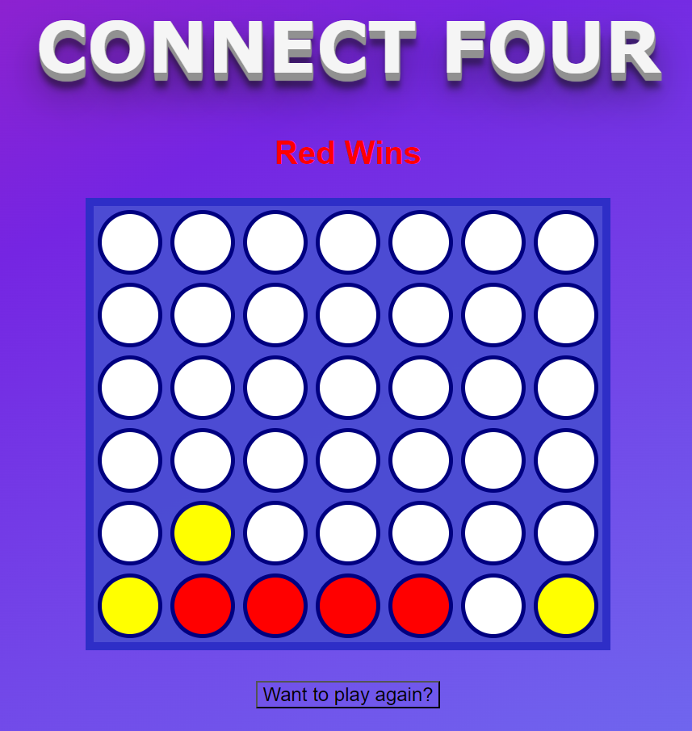

<h1 align="center" id='up' > Connect Four Game</h1>

<h2 id="table-of-contents">  [_|_]  Table of Contents</h2>

  
Table of Contents

  <ul>
    <li><a href="#introduction"> ➤ Introduction</a></li>
    <li><a href="#how-to-play"> ➤ How to Play and win</a></li>
    <li><a href="#learning"> ➤ Learning Highlights</a></li>
    <li><a href="#make-it-yours"> ➤ What you need to make it yours</a></li>
    <li><a href="#who"> ➤ Who is Raquel </a></li>
  </ul>

</img>

<h2 id="introduction"> (o´▽`o)ﾉ Introduction</h2>

Connect Four is a classic connecting game for two players. In this version the first player is red and the second player is yellow, taking turns dropping a colored disc from above onto a grid. The goal is to be the first to form a horizontal, vertical or diagonal line of four discs of your color.

This web-based Connect Four game is implemented using HTML, CSS and JavaScript. It features an interactive and adaptive game board with an easy to use interface.

</img>

<h2 id="how-to-play"> ( ノ-_-)ノﾞ_□ VS □_ヾ(^-^ヽ) How to Play and <strong>WIN</strong></h2>

- Open the [link](https://rpg87.github.io/Connect-4/).
- The first player will be red and the second player will be yellow.  
  <small>P.S.: If you play alone, you can be whoever you want as long as it is between yellow and red. Sorry there are no other options. Life is hard sometimes. </small>
- Click on any column of the grid to drop a disc of your color.
- The game will alternate between Red and Yellow player.
- The first player to connect four discs of their color in a row, column, or diagonal wins. What if no one wins? It's a tie.

If we have a winner, in addition to seeing on screen who has won, you will also hear the winner.

Do yo wanna play again? You have a button:

  </img>
  

 (＾◡＾)っ👆

<h3>Possibilities</h3>

Different scenarios

  <strong><u>ROW</u></strong>

 

 

  <strong><u>COLUMN</u></strong>

 

 

  <strong><u>DIAGONALLY</u></strong>

 

 

  <strong><u>TIE</u></strong>

 

</img>

<h2 id="learning"> 	__φ(。。) Learning Highlights</h2>

One interesting part of this code is how it dynamically creates the game board using JavaScript. It uses a two-dimensional array to represent the grid and adds event listeners to each grid cell to handle player moves. The game logic for checking winning conditions, such as horizontal, vertical, and diagonal connections, is also a significant part of the codebase.

</img>

<h2 id="make-it-yours"> (ˆ⌣ˆ)♡ What you need to make it yours</h2>

It is made with HTML, Css and Javascript so you don't need anything special. You can play directly by clicking on the [link](https://rpg87.github.io/Connect-4/), you can fork the project or you can download the entire game. It is up to you.

</img>

<h2 id="who"> (ﾉ◕ヮ◕)ﾉ*:･ﾟ✧ Who is Raquel</h2>

 I am Raquel, I consider myself a person with a great sense of humor, always eager to learn, a lover of challenges and this combination is what led me to study web development.

If you want to know more about me or if you have a fun project and you need help we could work together, you can find me [here](https://www.linkedin.com/in/raquel-pe-go/) 

</img>

 <a href="#up"> ▲ UP ▲</a>
